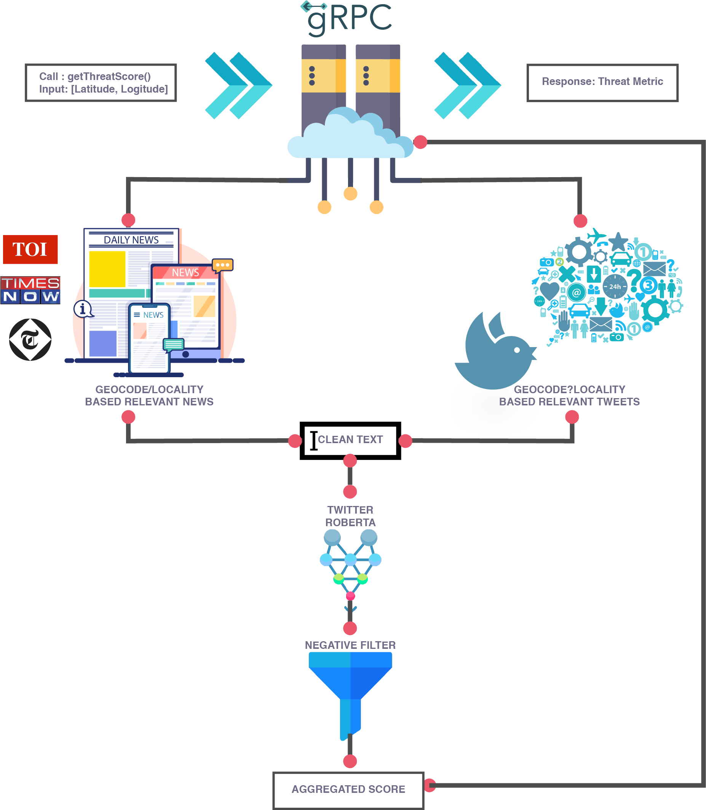

# Threat Intelligence Oracle (TIO)

<div id="top"></div>

<!-- PROJECT LOGO -->
<br />
<div align="center">
  <a href="https://github.com/Grow-Simplee-Team-11/Threat-Metric">
    
  </a>

  <h3 align="center">Threat Intelligence Oracle</h3>

  <p align="center">
    A prototype for demonstrating the a central threat en-route oracle.
    <br />
    <a href="https://github.com/Grow-Simplee-Team-11/Threat-Metric/wiki"><strong>Explore the docs »</strong></a>
    <br />
    <br />
    <a href="https://github.com/Grow-Simplee-Team-11/Threat-Metric">View Demo</a>
    ·
    <a href="https://github.com/Grow-Simplee-Team-11/Threat-Metric/issues">Report Bug</a>
    ·
    <a href="https://github.com/Grow-Simplee-Team-11/Threat-Metric/issues">Request Feature</a>
  </p>
</div>

<!-- TABLE OF CONTENTS -->
<details>
  <summary>Table of Contents</summary>
  <ol>
    <li>
      <a href="#about-the-project">About The Project</a>
      <ul>
        <li><a href="#built-with">Built With</a></li>
      </ul>
    </li>
    <li>
      <a href="#getting-started">Getting Started</a>
      <ul>
        <li><a href="#prerequisites">Prerequisites</a></li>
        <li><a href="#installation">Installation</a></li>
        <li><a href="#setting-debug-level">Setting DEBUG level</a></li>
      </ul>
    </li>
    <li><a href="#project-details">Project Details</a></li>
    <li><a href="#usage">Usage</a></li>
    <li><a href="#license">License</a></li>
    <li><a href="#contact">Contact</a></li>
    <li><a href="#acknowledgments">Acknowledgments</a></li>
  </ol>
</details>

<!-- ABOUT THE PROJECT -->

## About The Project



This project is a prototype for demonstrating the a central threat en-route oracle. The project is built primarily in the Python programming language. Social media applications hold a major stage in spreading all sorts of news in all the domains. Especially with the onset of Twitter and the hastag campaigns, all the latest happenings around the world are updating very fast. In this project we try to integrate data from the famous `Twitter API` and `News-APIs` that fetch data from the latest news-channels including `Times of India` and `The Telegraph`. The data is then processed using `Natural Language Processing` and `Sentiment Analysis` to determine the threat level of the news. The threat level is then stored in a `Redis` database and is used to determine the threat level of the en-route traffic. The threat level is then used to determine the traffic flow and the traffic is routed accordingly.

Following are some of the salient features of this project:

- **fetch_tweets**
  - Fetches tweets from Twitter API and stores them in a Redis database. The tweets are then processed using NLP and Sentiment Analysis to determine the threat level of the tweets. The threat level is then stored in a Redis database. The search is fine tuned and targed using the `#` hashtag and `geolocation` of the tweets.

- **fetch_news**
  - Fetches news from News API and processed using NLP and Sentiment Analysis to determine the threat level of the news. The threat level is then stored in a Redis database. The search is fine tuned and targed using the logical `OR` and `AND` operators to fetch the latest news targeted to the location and tagging `threats`.

- **geocoding**
  - The geocoding is done using the `Google Maps API` and the `geopy` library. The geocoding is done to determine the location of the tweets and news. The location is then used to determine the threat level of the en-route traffic. The location is broken down to several levels of granularity to determine the threat level of the en-route traffic, including `locality`, `sub-locality` and `administrative_area_level_1` (state).

- **efficient search**
  - The search is done using the `Twitter's` distance fine tuning using `geohash radius` and levels of location `granularity` to determine the threat level of the en-route traffic. The search is also done using the `News API` using the logical `OR` and `AND` operators to determine the threat level of the en-route traffic along with the `geohash radius` and levels of location `granularity`. 

- **Hand curatd threat list**
  - The threat list is hand curated and is used to determine the threat level of the en-route traffic. The threat list is used to determine the events that we should be interested in the specific radius around the location. AI works pretty well , but with manual intervention we can make it more efficient and accurate. Hence, the order of the threat events curated in the list makes it very important and practical to use.

> **Note:** So as not to exceed the limits of the APIs query complexity, the project is built to fetch data from the APIs only using specially curated groups of threats that are hand-picked and are of utmost importance. The project is built to be scalable and can be easily extended to fetch data from the APIs using all the threats in the threat list.

<p align="right">(<a href="#top">back to top</a>)</p>

### Built With

Following mentioned are the major frameworks/libraries used to bootstrap this project. Also included are the dependencies and addons used in this project.

- [Python](https://www.python.org/)
  - [grpc](https://grpc.io/)
  - [redis](https://redis.io/)
  - [googlemaps](https://pypi.org/project/googlemaps/)
  - [geopy](https://pypi.org/project/geopy/)
  - [newsapi-python](https://pypi.org/project/newsapi-python/)
  - [tweepy](https://pypi.org/project/tweepy/)
  - [nltk](https://pypi.org/project/nltk/)
  - [pandas](https://pypi.org/project/pandas/)
  - [numpy](https://pypi.org/project/numpy/)
  - [scipy](https://pypi.org/project/scipy/)
  - [transformers](https://pypi.org/project/transformers/)
  - [pytorch](https://pypi.org/project/pytorch/)
- [Hugging Face](https://huggingface.co/)
  - [Twitter Sentiment Analysis](https://huggingface.co/cardiffnlp/twitter-roberta-base-sentiment-latest)
  - [News Sentiment Analysis](https://huggingface.co/cardiffnlp/twitter-roberta-base-sentiment-latest)
- [Protobuf](https://developers.google.com/protocol-buffers)
- [Google Geocoding API](https://developers.google.com/maps/documentation/geocoding/overview)

<p align="right">(<a href="#top">back to top</a>)</p>

## Project Details

Following are the details of the file structure of this project:

```
Threat_Intelligence_Oracle
├── Data_Analysis
│   └── twitter_latest_news_sentiment_threat.ipynb
├── LICENSE
├── Makefile
├── README.md
├── .env.template
├── assets
│   └── flow.png
├── main.py
├── protos
│   └── threat.proto
├── requirements.txt
├── threat
│   ├── nlp.py
│   └── utils.py
├── threat_pb2.py
├── threat_pb2.pyi
└── threat_pb2_grpc.py
```

Following are the details of the file structure and their functionalities that are present in this code base.


<p align="right">(<a href="#top">back to top</a>)</p>

<!-- GETTING STARTED -->

## Getting Started

To get a local copy up and running follow these simple steps.

### Prerequisites

### Installation

<p align="right">(<a href="#top">back to top</a>)</p>

### Setting DEBUG level


<!-- USAGE EXAMPLES -->

## Usage


### User interaction with the system

### Running tests


### Visualizing Test Results


<p align="right">(<a href="#top">back to top</a>)</p>

<!-- LICENSE -->

## License

Distributed under the MIT License. See `LICENSE.txt` for more information.

<p align="right">(<a href="#top">back to top</a>)</p>

<!-- CONTACT -->

## Contact

| Email                        |
| ---------------------------- |
| simpleegrow23@gmail.com      |

<p align="right">(<a href="#top">back to top</a>)</p>

<!-- ACKNOWLEDGMENTS -->

## Acknowledgments

List of resources we found helpful and we would like to give them some credits.

- [Twitter Developer Platform](https://developer.twitter.com/en/docs/twitter-api/v1/tweets/search/api-reference/get-search-tweets)

<p align="right">(<a href="#top">back to top</a>)</p>
