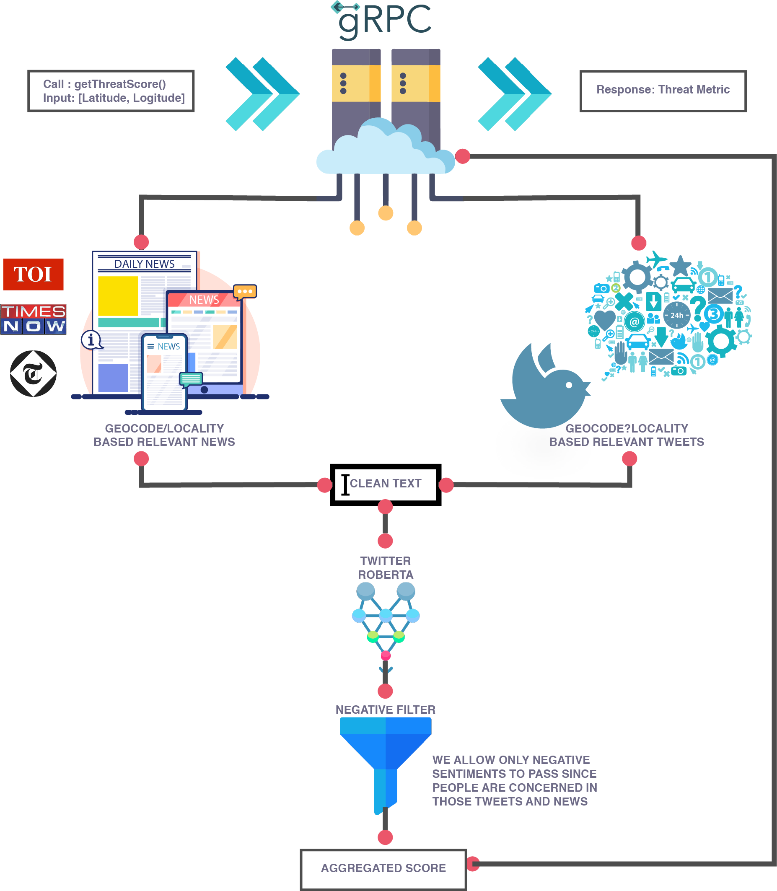

# Threat Intelligence Oracle (TIO)

<div id="top"></div>

<!-- PROJECT LOGO -->
<br />
<div align="center">
  <a href="https://github.com/Grow-Simplee-Team-11/Threat-Metric">
    
  </a>

  <h3 align="center">Threat Intelligence Oracle</h3>

  <p align="center">
    A prototype for demonstrating the a central threat en-route oracle.
    <br />
    <a href="https://github.com/Grow-Simplee-Team-11/Threat-Metric/wiki"><strong>Explore the docs »</strong></a>
    <br />
    <br />
    <a href="https://github.com/Grow-Simplee-Team-11/Threat-Intelligence-Oracle/blob/main/assets/screen_client_display.png">View Demo</a>
    ·
    <a href="https://github.com/Grow-Simplee-Team-11/Threat-Metric/issues">Report Bug</a>
    ·
    <a href="https://github.com/Grow-Simplee-Team-11/Threat-Metric/issues">Request Feature</a>
  </p>
</div>

<!-- TABLE OF CONTENTS -->
<details>
  <summary>Table of Contents</summary>
  <ol>
    <li>
      <a href="#about-the-project">About The Project</a>
      <ul>
        <li><a href="#built-with">Built With</a></li>
      </ul>
    </li>
    <li>
      <a href="#getting-started">Getting Started</a>
      <ul>
        <li><a href="#prerequisites">Prerequisites</a></li>
        <li><a href="#installation">Installation</a></li>
        <li><a href="#setting-debug-level">Setting DEBUG level</a></li>
      </ul>
    </li>
    <li><a href="#project-details">Project Details</a></li>
    <li><a href="#usage">Usage</a></li>
    <li><a href="#license">License</a></li>
    <li><a href="#contact">Contact</a></li>
    <li><a href="#acknowledgments">Acknowledgments</a></li>
  </ol>
</details>

<!-- ABOUT THE PROJECT -->

## About The Project



This project is a prototype for demonstrating the a central threat en-route oracle. The project is built primarily in the Python programming language. Social media applications hold a major stage in spreading all sorts of news in all the domains. Especially with the onset of Twitter and the hastag campaigns, all the latest happenings around the world are updating very fast. In this project we try to integrate data from the famous `Twitter API` and `News-APIs` that fetch data from the latest news-channels including `Times of India` and `The Telegraph`. The data is then processed using `Natural Language Processing` and `Sentiment Analysis` to determine the threat level of the news. The threat level is then stored in a `Redis` database and is used to determine the threat level of the en-route traffic. The threat level is then used to determine the traffic flow and the traffic is routed accordingly.

Following are some of the salient features of this project:

- **fetch_tweets**
  - Fetches tweets from Twitter API and stores them in a Redis database. The tweets are then processed using NLP and Sentiment Analysis to determine the threat level of the tweets. The threat level is then stored in a Redis database. The search is fine tuned and targed using the `#` hashtag and `geolocation` of the tweets.

- **fetch_news**
  - Fetches news from News API and processed using NLP and Sentiment Analysis to determine the threat level of the news. The threat level is then stored in a Redis database. The search is fine tuned and targed using the logical `OR` and `AND` operators to fetch the latest news targeted to the location and tagging `threats`.

- **geocoding**
  - The geocoding is done using the `Google Maps API` and the `geopy` library. The geocoding is done to determine the location of the tweets and news. The location is then used to determine the threat level of the en-route traffic. The location is broken down to several levels of granularity to determine the threat level of the en-route traffic, including `locality`, `sub-locality` and `administrative_area_level_1` (state).

- **efficient search**
  - The search is done using the `Twitter's` distance fine tuning using `geohash radius` and levels of location `granularity` to determine the threat level of the en-route traffic. The search is also done using the `News API` using the logical `OR` and `AND` operators to determine the threat level of the en-route traffic along with the `geohash radius` and levels of location `granularity`. 

- **Hand curatd threat list**
  - The threat list is hand curated and is used to determine the threat level of the en-route traffic. The threat list is used to determine the events that we should be interested in the specific radius around the location. AI works pretty well , but with manual intervention we can make it more efficient and accurate. Hence, the order of the threat events curated in the list makes it very important and practical to use.

> **Note:** So as not to exceed the limits of the APIs query complexity, the project is built to fetch data from the APIs only using specially curated groups of threats that are hand-picked and are of utmost importance. The project is built to be scalable and can be easily extended to fetch data from the APIs using all the threats in the threat list.

<p align="right">(<a href="#top">back to top</a>)</p>

### Built With

Following mentioned are the major frameworks/libraries used to bootstrap this project. Also included are the dependencies and addons used in this project.

- [Python](https://www.python.org/)
  - [grpc](https://grpc.io/)
  - [redis](https://redis.io/)
  - [googlemaps](https://pypi.org/project/googlemaps/)
  - [geopy](https://pypi.org/project/geopy/)
  - [newsapi-python](https://pypi.org/project/newsapi-python/)
  - [tweepy](https://pypi.org/project/tweepy/)
  - [nltk](https://pypi.org/project/nltk/)
  - [pandas](https://pypi.org/project/pandas/)
  - [numpy](https://pypi.org/project/numpy/)
  - [scipy](https://pypi.org/project/scipy/)
  - [transformers](https://pypi.org/project/transformers/)
  - [pytorch](https://pypi.org/project/pytorch/)
- [Hugging Face](https://huggingface.co/)
  - [Twitter Sentiment Analysis](https://huggingface.co/cardiffnlp/twitter-roberta-base-sentiment-latest)
  - [News Sentiment Analysis](https://huggingface.co/cardiffnlp/twitter-roberta-base-sentiment-latest)
- [Protobuf](https://developers.google.com/protocol-buffers)
- [Google Geocoding API](https://developers.google.com/maps/documentation/geocoding/overview)

<p align="right">(<a href="#top">back to top</a>)</p>

## Project Details

Following are the details of the file structure of this project:

```
Threat_Intelligence_Oracle
├── Data_Analysis
│   └── twitter_latest_news_sentiment_threat.ipynb
├── LICENSE
├── Makefile
├── README.md
├── .env.template
├── assets
│   ├── screen_client_display.png
│   ├── screen_server_display.png
│   ├── logo.png
│   └── flow.png
├── main.py
├── protos
│   └── threat.proto
├── requirements.txt
├── threat
│   ├── nlp.py
│   └── utils.py
├── threat_pb2.py
├── threat_pb2.pyi
└── threat_pb2_grpc.py
```

Following are the details of the file structure and their functionalities that are present in this code base.

* Data_Analysis
  * `twitter_latest_news_sentiment_threat.ipynb` - This notebook contains the code for the data analysis of the tweets and news fetched from the Twitter and News API respectively. The notebook also contains the code for the NLP and Sentiment Analysis of the tweets and news. The notebook also contains the code for the threat level determination of the tweets and news. This notebook primarily outlines the thought process and the methodology used to determine the threat level of the tweets and news and the fine tuning of the keywords used to fetch the tweets and news from the Twitter and News API respectively.
* assets
  * `flow.png` - This image contains the flow of the project.
  * `logo.png` - This image contains the logo of the project.
  * `screen_client_display.png` - This image contains the screenshot of the client display.
  * `screen_server_display.png` - This image contains the screenshot of the server display.
* protos
  * `threat.proto` - This file contains the protocol buffer definition of the `Threat` Service, `ThreatRequest` and `ThreatResponse` messages. The `ThreatService` is used to fetch the threat level of the en-route traffic using the `getThreatScore` facility. The `ThreatRequest` message is used to send the request to the `Threat Service` and the `ThreatResponse` message is used to send the response from the `Threat Service`.
* threat
  * `nlp.py` - This file contains the code for the NLP and Sentiment Analysis utilities of the tweets and news.
    * ***clean_text*** - This function is used to clean the text of the tweets and news. The function takes the text as input and returns the cleaned text as output. The function performs the following tasks:
      * Removes the URLs from the text.
      * Removes the HTML tags from the text.
      * Removes the special characters from the text.
      * Removes the punctuations from the text.
      * Removes the stopwords from the text.
      * Removes the emojis from the text.
      * Removes the numbers from the text.
      * Removes the whitespaces from the text.
      * Converts the text to lowercase.
      * Lemmatizes the text.
    * ***fetch_sentiment*** - This function is used to get the sentiment of the text of the tweets and news. The function takes the text as input and returns the sentiment of the text as output. The function performs the following tasks:
      * Fetches the sentiment of the text using the `Twitter Sentiment Analysis` model.
      * Fetches the sentiment of the text using the `News Sentiment Analysis` model.
      * Returns the sentiment of the text as the average of the sentiment of the text fetched from the `Twitter Sentiment Analysis` model and the `News Sentiment Analysis` model.
  * `utils.py` - This file contains the code for the threat level determination of the tweets and news.
    * ***init*** - This function is used to initialize APIs required the `Threat` Service. The function performs the following tasks:
      * Initializes the `Twitter API` and `News API` using the `API_KEY` and `API_SECRET_KEY` environment variables.
      * Initializes the `Google Geocoding API` using the `GOOGLE_API_KEY` environment variable.
      * Initializes the `Hugging Face` models.
    * ***fetch_locale*** - This function is used to fetch the locale of the location. The function takes the location as input and returns the locale of the location as output. The function performs the following tasks:
      * Fetches the latitude and longitude of the location using the `Google Geocoding API`.
      * Fetches the locale of the location using the `Google Geocoding API`.
      * Returns the locale of the location.
    * ***fetch_tweets*** - This function is used to fetch the tweets from the `Twitter API`. The function takes the location as input and returns the tweets as output. The function performs the following tasks:
      * Fetches the locale of the location.
      * Fetches the tweets from the `Twitter API` using the locale of the location and `Advanced Search` query with integrated `OR` operator for `batched` keywords.
      * Returns the tweets.
    * ***fetch_news*** - This function is used to fetch the news from the `News API`. The function takes the location as input and returns the news as output. The function performs the following tasks:
      * Fetches the locale of the location.
      * Fetches the news from the `News API` using the locale of the location and `Advanced Search` query with integrated `OR` operator for `batched` keywords.
      * Returns the news.

<p align="right">(<a href="#top">back to top</a>)</p>

<!-- GETTING STARTED -->

## Getting Started

To get a local copy up and running follow these simple steps.

### Prerequisites

* ***Python 3.10.6 or higher*** - The project is built using Python 3.10.6. You can download Python 3.10.6 from [Python-3.10.6](https://www.python.org/downloads/release/python-360/).
* ***pip*** - The project uses `pip` to install the dependencies. You can download `pip` from [pip](https://pip.pypa.io/en/stable/installing/).
* ***virtualenv*** - The project uses `virtualenv` to create a virtual environment. You can download `virtualenv` from [virtualenv](https://virtualenv.pypa.io/en/latest/installation.html).
* ***Google Geocoding API*** - The project uses `Google Geocoding API` to fetch the latitude and longitude of the location. You can get the `Google Geocoding API` from [Google Geocoding API](https://developers.google.com/maps/documentation/geocoding/overview).
  * The `Google Geocoding API` requires the `GOOGLE_API_KEY` environment variable to be set. 
  * The API key can be obtained from [Google Cloud Platform](https://console.cloud.google.com/).
* ***Twitter API*** - The project uses `Twitter API` to fetch the tweets. You can get the `Twitter API` from [Twitter API](https://developer.twitter.com/en/docs/twitter-api).
  * The `Twitter API` requires the `API_KEY` and `API_SECRET_KEY` environment variables to be set.
  * The API key and API secret key can be obtained from [Twitter Developer Portal](https://developer.twitter.com/en/portal/dashboard).
* ***News API*** - The project uses `News API` to fetch the news. You can get the `News API` from [News API](https://newsapi.org/).
  * The `News API` requires the `API_KEY` environment variable to be set.
  * The API key can be obtained from [News API](https://newsapi.org/).

### Installation

1. Clone the repo
   ```sh
   git clone https://github.com/Grow-Simplee-Team-11/Threat-Intelligence-Oracle.git
    ```
2. Create a virtual environment
    ```sh
    virtualenv venv
    ```
3. Activate the virtual environment
    ```sh
    source venv/bin/activate
    ```
4. Install the dependencies
    ```sh
    pip install -r requirements.txt
    ```
5. Set the environment variables in the .env file following the format in the .env.template file
    ```sh
    API_KEY = "GOOGLE_API_KEY_HERE" #@param {type:"string"}
    NEWS_API = "NEWS_API_KEY_HERE" #@param {type:"string"}
    BEARER_TOKEN = "TWITTER_BEARER_TOKEN_HERE" #@param {type:"string"}
    ```

<p align="right">(<a href="#top">back to top</a>)</p>

<!-- USAGE EXAMPLES -->

## Usage

### Running the server

1. Activate the virtual environment
    ```sh
    source venv/bin/activate
    ```
2. Run the server
    ```sh
    python server.py
    ```
3. The server will be running on `http://localhost:8080/`

### Running the client

***User interaction with the system***

[Recommended] To check the working of the server, make use of the Postman GUI.

1. Open Postman
2. Select the `gRPC` option from the `New` dropdown menu on the top left corner. 
3. Enter the `http://localhost:8080/` in the `Enter request URL` field.
4. Upload the `threat.proto` file in the `gRPC` tab.
5. Select the `Threat` service and `getThreatScore` method from the dropdown menu.
6. Enter the location in the `location` field.

### Running tests


### Visualizing Test Results

***Server***


***Client***


<p align="right">(<a href="#top">back to top</a>)</p>

<!-- LICENSE -->

## License

Distributed under the MIT License. See `LICENSE.txt` for more information.

<p align="right">(<a href="#top">back to top</a>)</p>

<!-- CONTACT -->

## Contact

| Email                        |
| ---------------------------- |
| simpleegrow23@gmail.com      |

<p align="right">(<a href="#top">back to top</a>)</p>

<!-- ACKNOWLEDGMENTS -->

## Acknowledgments

List of resources we found helpful and we would like to give them some credits.

- [News API](https://newsapi.org/docs/endpoints/everything)
- [Hugging Face](https://huggingface.co/)
- [CardiffNLP/timelms](https://github.com/cardiffnlp/timelms)
- [Google Geocoding API](https://developers.google.com/maps/documentation/geocoding/overview)
- [Twitter Sentiment Analysis](https://huggingface.co/cardiffnlp/twitter-roberta-base-sentiment-latest)
- [Twitter Developer Platform](https://developer.twitter.com/en/docs/twitter-api/v1/tweets/search/api-reference/get-search-tweets)
- [TimeLMs: Diachronic Language Models from Twitter](https://arxiv.org/abs/2202.03829)

<p align="right">(<a href="#top">back to top</a>)</p>
